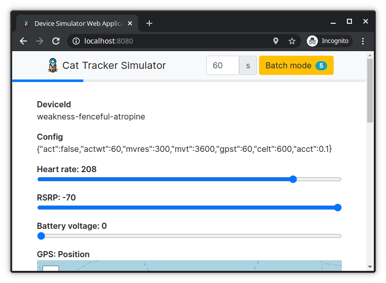

.. _aws-customization-customize-device-simulator-ui:

Customize the device simulator UI
#################################

You can now implement the logic to generate the heart rate monitoring data by modifying the device simulator UI.
Once this functionality is implemented, the firmware will sample the heart rate in a given interval (for example, once very minute), and send it to the cloud using a :ref:`batch message <batch-messages>`.
Following is an example for customization of the device simulator UI:

* Add a slider for the heart rate reading between 140 and 220 (which are considered as normal heart rates for a cat)
* Use the `queueUpdate` method to send the readings as a batch message

The code for the necessary changes can be viewed in the `simulator-ui repository <https://github.com/acme-cat-tracker/simulator-ui/compare/add-heartrate-monitor-data>`_.

The following image shows the customization done on the device simulator UI:

   Creating batched heart rate messages using the device simulator UI

The device simulator sends the following message to the cloud:

.. code-block:: json

    {
        "heartrate": [
            { "v": 157, "ts": 1615467185022 },
            { "v": 163, "ts": 1615467185976 },
            { "v": 191, "ts": 1615467186878 },
            { "v": 205, "ts": 1615467187418 },
            { "v": 208, "ts": 1615467189071 }
        ]
    }

If you want to save the changes to the device simulator UI in your own repository, maintain a fork and add the source repository as ``upstream``:
 
    
.. code-block:: bash
    
   git remote add upstream https://github.com/NordicSemiconductor/asset-tracker-cloud-device-ui-js

.. pull-changes-source-start

To pull the changes from the source repository, run the following commands and resolve all the conflicts:

.. code-block:: bash

   git fetch upstream saga
   git rebase upstream/saga

.. pull-changes-source-end
