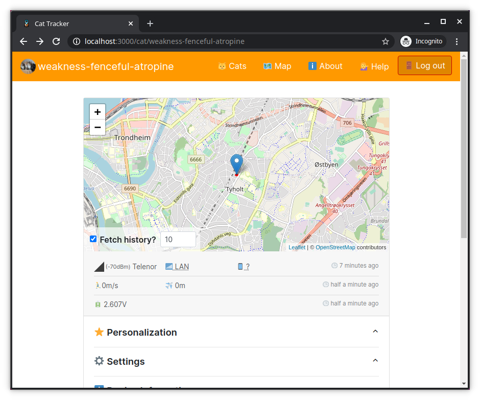
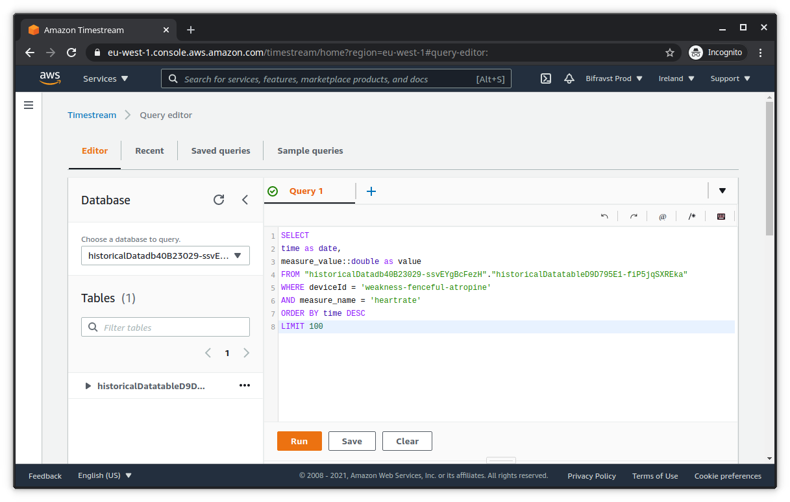

.. _aws-customization-customize-web-app:

Customize the Cat Tracker web application
#########################################

Now we can continue with customzing the web application.

The heart rate readings should be visualized in a new chart on the :ref:`Cat Tracker web application <index-cat-tracker-web-app>`.

Navigate to the web application directory created, when following the :ref:`Getting Started guide <aws-getting-started-app>`:

.. code-block:: bash

    cd ~/nrf-asset-tracker/cat-tracker-web-app
    # ~/nrf-asset-tracker/cat-tracker-web-app

Run the development server:

.. code-block:: bash

    npm start

Now you can open the web application at `<http://localhost:3000>`_ and select the simulated cat.

We are now ready to modify the web application and add a new chart section that displays the most recent heart rate readings.

For this we first need to define the SQL query that fetches the data we are interested in from Timestream.
The Timestream Query Browser on the AWS Console is very helpful for that:

The query that selects the last 100 heartrate readings for our device is:

.. code-block:: SQL

    SELECT
    -- `date` and `value` are columen names used in the React component that renders the chart
    time as date,
    measure_value::double as value
    FROM '<table>'
    WHERE deviceId='<catId>'
    AND measure_name = 'heartrate'
    ORDER BY time DESC
    LIMIT 100

For a documenation of the syntax, see `Timestream Query language <https://docs.aws.amazon.com/timestream/latest/developerguide/reference.html>`_.

Once we are happy with the query, we need to add a new chart to the Cat Tracker web application, that displays the data in a line chart.

You can see the neccessary changes `in this repository <https://github.com/acme-cat-tracker/web-app/compare/add-heartrate-monitor-data>`_.

.. figure:: ./images/web-app-with-heart-rate-readings.png
   :alt: Cat Tracker web application showing the heart rate readings

.. admonition:: Maintaining a fork

   In case you want to persist the changes to the Cat Tracker web application in your own repository, add the source repository as ``upstream`` so you can later pull in changes: 
   
   .. code-block:: bash
   
       git remote add upstream https://github.com/NordicSemiconductor/asset-tracker-cloud-app-js

   You pull in changes by running the following commands and resolving all conflicts.

   .. code-block:: bash

       git fetch upstream saga
       git rebase upstream/saga