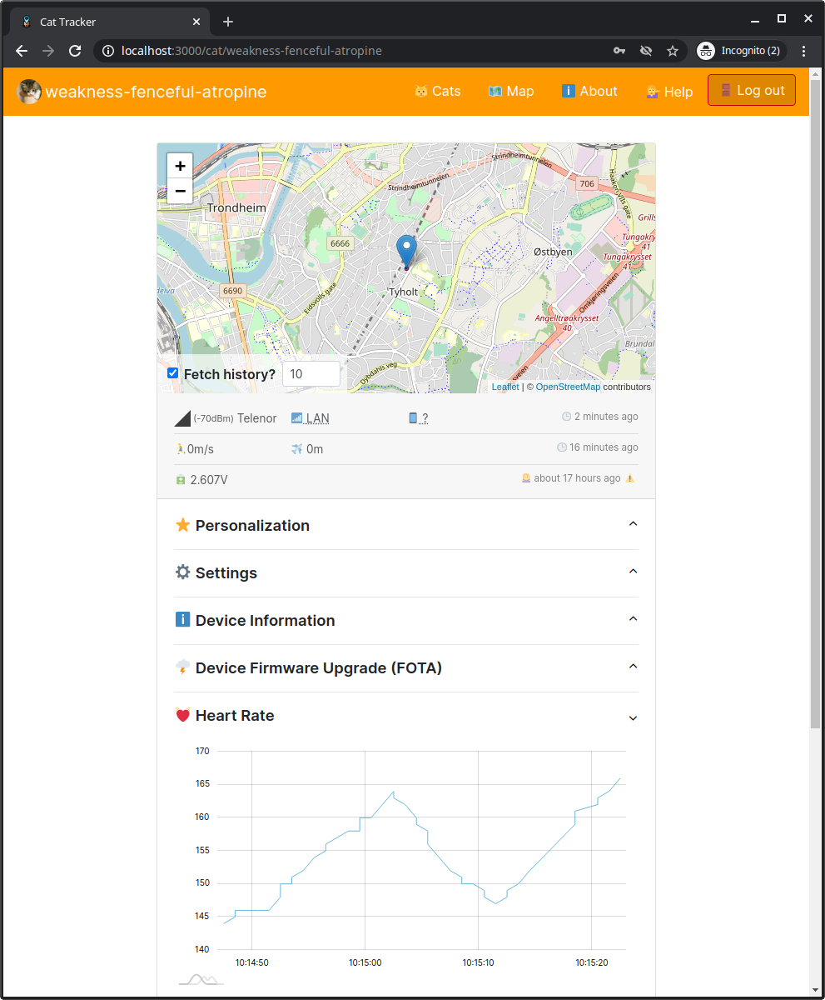

.. _aws-customization-customize-web-app:

Customize the nRF Asset Tracker web application
###############################################

The next step is to customize the web application.
The heart rate readings must be visualized in a new chart on the :ref:`nRF Asset Tracker web application <index-cat-tracker-web-app>`.

To customize the web application, complete the following steps:

1. Navigate to the web application directory created while :ref:`deploying the nRF Asset Tracker web application to AWS <aws-getting-started-app>`:

   .. code-block:: bash

      cd ~/nrf-asset-tracker/cat-tracker-web-app
      # ~/nrf-asset-tracker/cat-tracker-web-app

#. Run the development server:

   .. code-block:: bash

      npm start

#. Open the web application by typing `<http://localhost:3000>`_ in the address bar and select the entry for the simulated cat.

   .. figure:: ./images/web-app.png
      :alt: The nRF Asset Tracker web application

   At this point, you can start modifying the web application and add a new chart section that displays the latest heart rate readings.

#. Define the SQL query that fetches the data of interest from `Timestream <https://docs.aws.amazon.com/timestream/latest/developerguide/what-is-timestream.html>`_.
   As shown in the following image, you can use the Timestream Query Browser on the AWS Console for defining the query:

   .. figure:: ./images/timestream-query-browser.png
      :alt: Timestream query browser

   The following query selects the last 100 heart rate readings for the device:

   .. parsed-literal::
      :class: highlight

      SELECT
      -- `date` and `value` are column names used in the React component that renders the chart
      time as date,
      measure_value::double as value
      FROM '*table*'
      WHERE deviceId='*catId*'
      AND measure_name = 'heartrate'
      ORDER BY time DESC
      LIMIT 100

   To learn more about the syntax, see `Timestream Query language <https://docs.aws.amazon.com/timestream/latest/developerguide/reference.html>`_.

#. After defining the query, add a new chart to the nRF Asset Tracker web application that displays the data in a line chart.

You can view the code for the necessary changes in the `simulator-ui repository  <https://github.com/acme-cat-tracker/web-app/compare/add-heartrate-monitor-data>`_.

	  
   nRF Asset Tracker web application showing the heart rate readings

At this point, you have successfully customized the nRF Asset Tracker web application.

If you want to save your changes to the nRF Asset Tracker web application in your own repository, maintain a fork and add the source repository as ``upstream``:

.. code-block:: bash
   
   git remote add upstream https://github.com/NordicSemiconductor/asset-tracker-cloud-app-js

.. include:: CustomizeSimulator.rst
   :start-after: pull-changes-source-start
   :end-before: pull-changes-source-end
