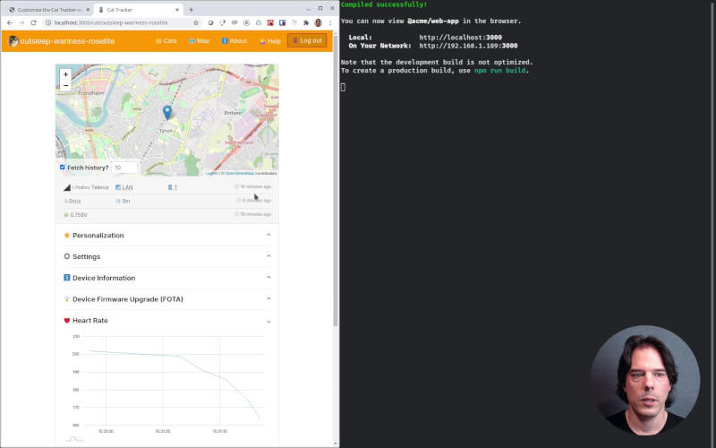

.. _aws-customization:

Customization
#############

This section walks you through customization the *nRF Asset Tracker* for your own product by showing how to visualize additional sensor data on the :ref:`Cat Tracker web application <index-cat-tracker-web-app>`.

1.  we will modify the :ref:`Device Simulator UI <simulator>` to generate the heart-rate sensor data.
#.  we will then modify the :ref:`Cat Tracker web application <index-cat-tracker-web-app>` to display the data.

Before you start, ensure that you have :ref:`set up the nRF Asset Tracker for AWS <aws-getting-started>`.

Then complete the following steps:

.. toctree::
   :titlesonly:

   RunSimulator.rst
   CustomizeSimulator.rst
   CustomizeWebApp.rst
   Finish.rst

This *Customization guide* has also been recorded as a video:

   Customizing the nRF Asset Tracker for AWS - Adding a heart rate sensor (video)

+-------+----------------------------------------------------------------------------------------------------+
| Time  | Chapter                                                                                            |
+=======+====================================================================================================+
| 00:06 | `Adding the heartrate measuring to the Cat Tracker <https://youtu.be/d_ytGb9wdb8?t=6>`_            |
+-------+----------------------------------------------------------------------------------------------------+
| 01:55 | `Customization overview <https://youtu.be/d_ytGb9wdb8?t=115>`_                                     |
+-------+----------------------------------------------------------------------------------------------------+
| 02:25 | `Device simulator UI introduction <https://youtu.be/d_ytGb9wdb8?t=145>`_                           |
+-------+----------------------------------------------------------------------------------------------------+
| 03:01 | `Cloning and running the device simulator UI <https://youtu.be/d_ytGb9wdb8?t=181>`_                |
+-------+----------------------------------------------------------------------------------------------------+
| 03:56 | `Creating a new device certificate for the device simulator <https://youtu.be/d_ytGb9wdb8?t=236>`_ |
+-------+----------------------------------------------------------------------------------------------------+
| 04:36 | `Using the simulated device with the simulator UI <https://youtu.be/d_ytGb9wdb8?t=276>`_           |
+-------+----------------------------------------------------------------------------------------------------+
| 05:19 | `Batch mode <https://youtu.be/d_ytGb9wdb8?t=319>`_                                                 |
+-------+----------------------------------------------------------------------------------------------------+
| 06:09 | `Adding the heart rate data UI to the simulator <https://youtu.be/d_ytGb9wdb8?t=369>`_             |
+-------+----------------------------------------------------------------------------------------------------+
| 09:46 | `Using the updated simulator UI <https://youtu.be/d_ytGb9wdb8?t=586>`_                             |
+-------+----------------------------------------------------------------------------------------------------+
| 11:24 | `Customizing the Cat Tracker web application <https://youtu.be/d_ytGb9wdb8?t=684>`_                |
+-------+----------------------------------------------------------------------------------------------------+
| 12:29 | `Code walkthrough <https://youtu.be/d_ytGb9wdb8?t=749>`_                                           |
+-------+----------------------------------------------------------------------------------------------------+
| 14:01 | `How the new chart is built <https://youtu.be/d_ytGb9wdb8?t=841>`_                                 |
+-------+----------------------------------------------------------------------------------------------------+
| 14:58 | `General introduction to charts <https://youtu.be/d_ytGb9wdb8?t=898>`_                             |
+-------+----------------------------------------------------------------------------------------------------+
| 15:36 | `How to query Timestream <https://youtu.be/d_ytGb9wdb8?t=936>`_                                    |
+-------+----------------------------------------------------------------------------------------------------+
| 16:52 | `Timestream query editor <https://youtu.be/d_ytGb9wdb8?t=1012>`_                                   |
+-------+----------------------------------------------------------------------------------------------------+
| 19:28 | `Summary <https://youtu.be/d_ytGb9wdb8?t=1168>`_                                                   |
+-------+----------------------------------------------------------------------------------------------------+
| 20:14 | `Outro <https://youtu.be/d_ytGb9wdb8?t=1214>`_                                                     |
+-------+----------------------------------------------------------------------------------------------------+
