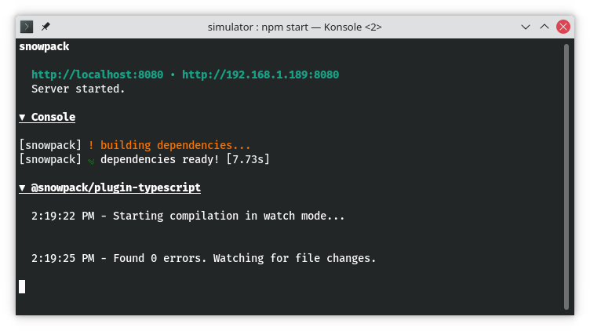
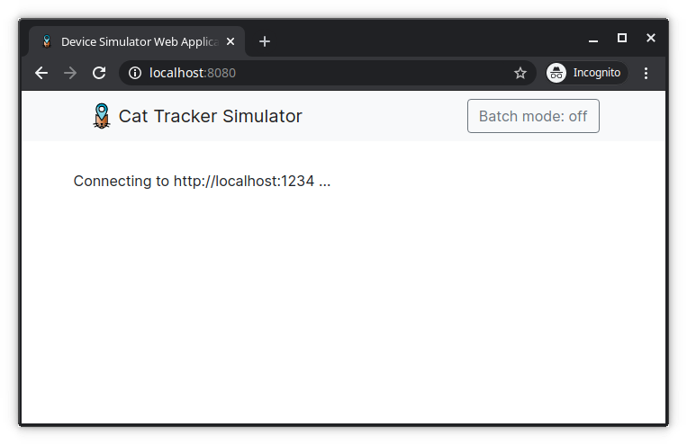
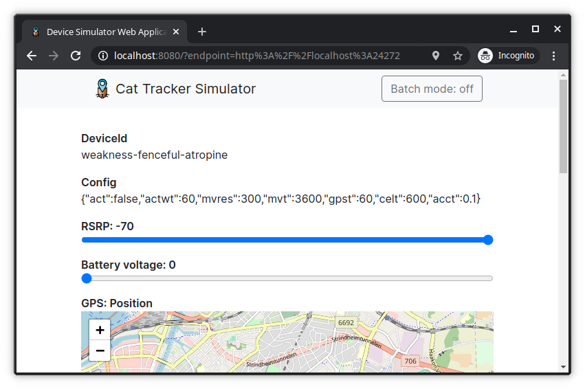

.. _aws-customization-run-device-simulator-ui:

Run the device simulator UI
###########################

We start in our :ref:`working directory <aws-working-directory>`:

.. code-block:: bash

    cd nrf-asset-tracker
    # ~/nrf-asset-tracker

First, clone the device simulator user-interface (UI) and install the dependencies:

.. code-block:: bash

    git clone https://github.com/NordicSemiconductor/asset-tracker-cloud-device-ui-js simulator-ui
    cd simulator-ui
    npm ci

Start the device simulator UI's development server:

.. code-block:: bash

    npm start

and open the browser at `<http://localhost:8080>`_.

You will see the device simulator UI:

Now, create a new device for use with the simulator

.. code-block:: bash

    cd nrf-asset-tracker/aws
    # Create a new certificate
    node cli create-device-cert
    # Now connect with the certificate using the device simulator
    node cli connect '<device id>'

Copy the query string of the URL printed after :guilabel:`To control this device open your browser on:`, e.g. ``?endpoint=http%3A%2F%2Flocalhost%3A24272`` and append it to the URL in the browser and press enter.

The UI will not connect to the simulator run by the CLI:

