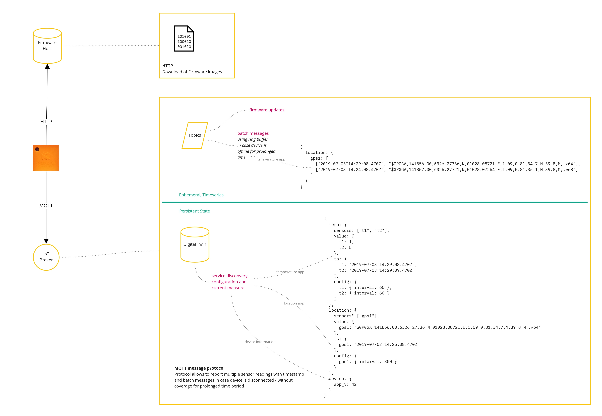
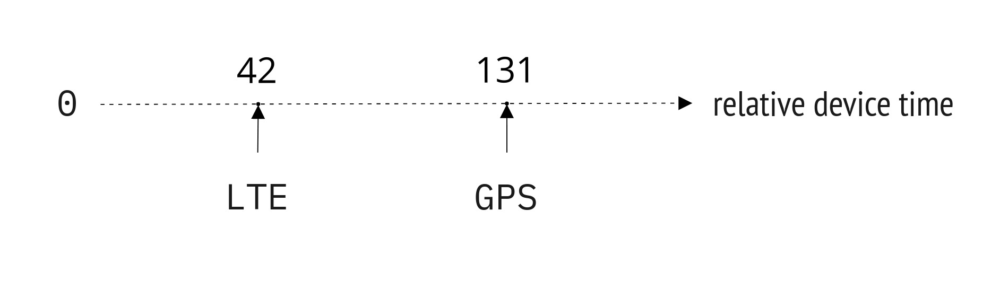

.. _four-kinds-data:

Four kinds of data
##################

This section provides a general introduction about the device communication with the cloud in the *nRF Asset Tracker* project.
This is also available as a stand-alone `blog post on DevZone <https://devzone.nordicsemi.com/nordic/nordic-blog/b/blog/posts/the-four-kinds-of-data-you-need-to-consider-when-developing-an-iot-product>`_.

    Data protocols

Following are the four types of data that is used in the communication of the device with the cloud:

* Device state
* Device configuration
* Past state
* Firmware upgrades (FOTA) 

Device state
************

The firmware needs to communicate with the cloud to send the position updates and important information about the health of the device (an example is the battery level, which is a critical health indicator).
This data is considered as the *device state*.
Since the latest state of the device is always required, a *digital twin* is used to store this state on the cloud side.
Whenever the device sends an update, the *digital twin* is updated.
This allows the web application to access the most recent state of the device immediately without waiting for the device to connect and publish its state.

An important criterion for the robustness of any IoT product is the graceful handling of situations in which the device is not connected to the internet.
It might not be favorable for a device to be connected all the time since wireless communication is relatively expensive, consumes a lot of energy thereby increasing the power consumption in the device.

The firmware is optimized for ultra-low power consumption, and the design aims in reducing the modem uptime and keep the modem in the off state as long as possible.
This is achieved by making the device smart and allowing it to decide on sending the data based on the situation.

In *passive* mode, data is sent when movement is detected.
The accelerometer *wakes up* the application thread, which then tries to acquire a GPS fix and a cellular connection.
If movement is no longer detected, the modem will be turned off and the application returns to the sleep state.
The *passive* mode is designed to conserve energy as much as possible.
Nevertheless, it is preferred that the device sends an update occasionally, so that the battery condition is known and conditions such as non-functioning of motion sensor can be detected.

Device configuration
********************

Optimizing the device behavior takes time and while the devices are in the field, sending firmware upgrades for every change will be expensive.
The usual firmware sizes are around 500 KB, which will be expensive even after compression since it will take some time for a device to download and apply the upgrade.
Additionally, there will be costs for transferring the firmware upgrade over the cellular network.
Especially in NB-IoT-only deployments, the data rate is low.
Upgrading a fleet of devices with a new firmware involves orchestrating the roll-out and monitoring the faults.
All these challenges mandate the ability to *configure the device*, which allows to tweak the behavior of the device until the inflection point is reached with respect to battery life and data granularity.

An interesting configuration option is the sensitivity of the motion sensor.
The action that is considered as a *movement* varies from one tracked subject to another.
A device has various timeout settings such as the waiting time to acquire a GPS fix, or the waiting time between updates that are sent when the device is in motion.
The timeout settings have an important influence on power consumption and data consumption.

When the device is put in an *active* mode, it sends updates based on a configurable interval regardless of whether motion is detected or not.
This is advantageous when actively developing the firmware with individual devices or when debugging the device behavior in specific areas and situations.

*Device configuration* is needed if the device must control a particular parameter.
An example is a smart lock, which needs to manipulate the state of a physical lock.
The backend requires a way to convey the state in which the lock must be in, to the device.
This setting needs to be persistently stored on the cloud side since the device could lose power, crash, or lose the information that decides if the lock must be open or closed.

In this case, the *digital twin* is used to immediately store the latest *desired* configuration of the device on the cloud side.
Hence the application need not wait for the device to be connected to record the configuration change.
The implementation of the *digital twin* will then take care of sending only the latest required changes to the device (all the changes that follow the last request from the device for its configuration are combined into a single change) thus, minimizing the amount of data that needs to be transferred to the device.

.. _firmware-protocol-timestamping:

Timestamping
============

Device *state* and *configuration* are timeless data that are always required.
The device sends a GPS position over the cellular connection and the digital twin is updated.
Thus, the current location of the device can be known.
When the device configuration is changed (``A -> A'``) the device will eventually apply the new configuration, and if another configuration change was made while the device was not connected (``A' -> A''``) the device can directly transition to ``A''``.
To make state and configuration changes available over time, all the changes can be stored on the cloud side with the timestamp associated with the change and made available for retrieval in a time-series manner.

This approach has an inherent problem.
If the battery level measured by the device must be stored with the time it was received by the cloud, the timestamp will not be accurate.
If the device took a while to establish the cellular connection to send the update, there will be a delay of few minutes between the sampling of the battery voltage and the time when the update is finally delivered to the receiving end.
While this might be acceptable with a sensor that has low volatility, it might not be acceptable in scenarios where it is important to know the exact timestamp related to an event.
Consider the case of tracking parcels where it is important to track if a parcel is dropped.
A few minutes of difference can impact the estimation of the exact state of the parcel (for example, parcel being moved by a person or in transit).

It is important to have precise time measurement on the device and it is achieved by combining the following time sources:

* Relative device timestamp (a relative time with microsecond resolution that counts upwards from zero after the device is powered on)
* Cellular network time
* Time from the GPS sensor

   Time stamping

Whenever a sensor is read, the value is recorded with the device timestamp.
Once these recorded measurements are ready to be sent (in the presence of a cellular connection and the network time is known), the relative timestamps can be converted to absolute timestamps using the *relative* timestamps of the network or the GPS time.

In this way, all the data is sent with precise timestamps to the cloud where the device time is used when visualizing the data to accurately reflect the time of creation of the datum.

Past State
**********

There can be scenarios when the position updates are collected only when a cellular connection can be established.
Consider a reindeer tracker, which tracks the position of a herd.
The reindeer tracker will report movement only along ridges, but never in valleys.
This is because the cellular signal does not have coverage in remote valleys.
The GPS signal however will be received from the tracker since the satellites, which are high on the horizon can send the signal down into the valley.

There are many scenarios where the cellular connection might not be available or might be unreliable, but the reading sensors work.
Robust ultra-mobile IoT products therefore must incorporate such conditions into the normal mode of operation.
The absence of a cellular connection must be treated as a temporary condition, which will eventually resolve and until then normal mode of operation must continue.
This means that the devices must continue to measure and store these measurements in a ring buffer or employ other strategies to decide on the data to be discarded once the memory limit is reached.

Once the device can establish a connection successfully, it will publish the past data in batch (after publishing its most recent measurements).
Since the device memory is limited, a strategy must be created to discard old messages.
A simple approach is to use a ring buffer that stores the latest messages and will discard the oldest message once the size limit is reached.

This is also applicable for devices that control a system.
Such devices must have built-in decision rules and they must not depend on the cloud backend to provide the action to be executed based on the current condition.

Firmware Upgrades (FOTA)
************************

Firmware upgrade *over the air* (FOTA) can be seen as a device configuration.
However, the size of a typical firmware image (500KB) is 2 to 3 times larger than the size of a control message.
Therefore, it can be beneficial to treat it differently.
Typically, an upgrade is initiated by a configuration change.
Once the device acknowledges, the firmware download is initiated.
To reduce the overhead, the firmware download is done out of band using HTTP or HTTPS instead of MQTT.

The firmware upgrades are large compared to the other messages.
Hence, to conserve resources, the device might suspend all the other operations until the firmware upgrade has been applied.

Summary
*******

The *nRF Asset Tracker* aims to provide robust reference implementations for the four kinds of device data.
Even though the concrete implementation differs for each cloud provider, the general building blocks (state, configuration, batched past state, firmware upgrades) will be the same.

+-------------------------------------+-------------------------+------------------+-----------+-------------------+
| Cloud                               | State                   | Configuration    | Past data | FOTA              |
+=====================================+=========================+==================+===========+===================+
| :abbr:`AWS (Amazon Web Services)`   | `Device shadow`_        | `Device shadow`_ | MQTT      | `Jobs`_ and HTTPS |
|                                     |                         |                  |           |                   |
|                                     | ``reported``            | ``desired``      |           |                   |
+-------------------------------------+-------------------------+------------------+-----------+-------------------+
| :abbr:`GCP (Google Cloud Platform)` | `Device configuration`_ | `Device state`_  | MQTT      |                   |
+-------------------------------------+-------------------------+------------------+-----------+-------------------+
| :abbr:`Azure (Microsoft Azure)`     | `Device twins`_         | `Device twins`_  | MQTT      | `MQTT and HTTPS`_ |
|                                     |                         |                  |           |                   |
|                                     | ``reported``            | ``desired``      |           |                   |
+-------------------------------------+-------------------------+------------------+-----------+-------------------+

.. _Device shadow: https://docs.aws.amazon.com/iot/latest/developerguide/iot-device-shadows.html
.. _Jobs: https://docs.aws.amazon.com/iot/latest/developerguide/iot-jobs.html
.. _Device configuration: https://cloud.google.com/iot/docs/concepts/devices#device_configuration>
.. _Device state: https://cloud.google.com/iot/docs/concepts/devices#device_state
.. _Device twins: https://docs.microsoft.com/en-us/azure/iot-hub/iot-hub-devguide-device-twins
.. _MQTT and HTTPS: https://docs.microsoft.com/en-us/azure/iot-hub/tutorial-firmware-update